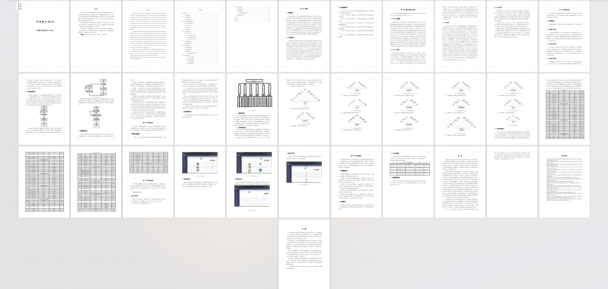
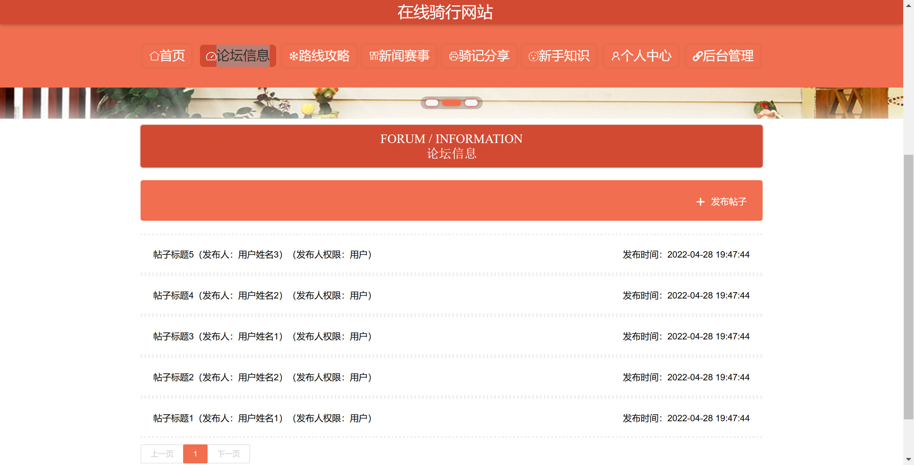
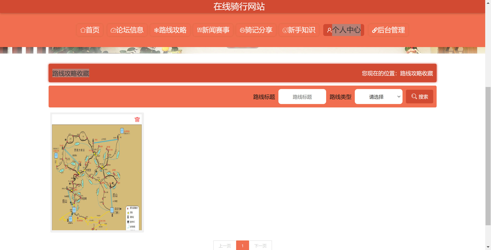
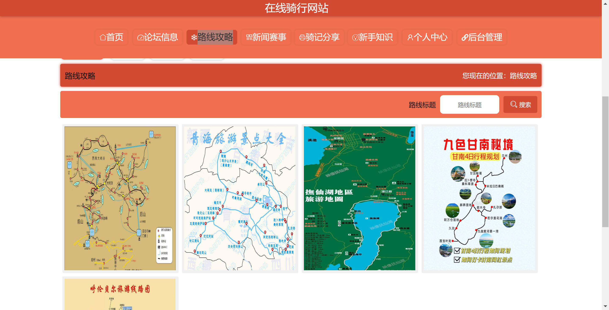
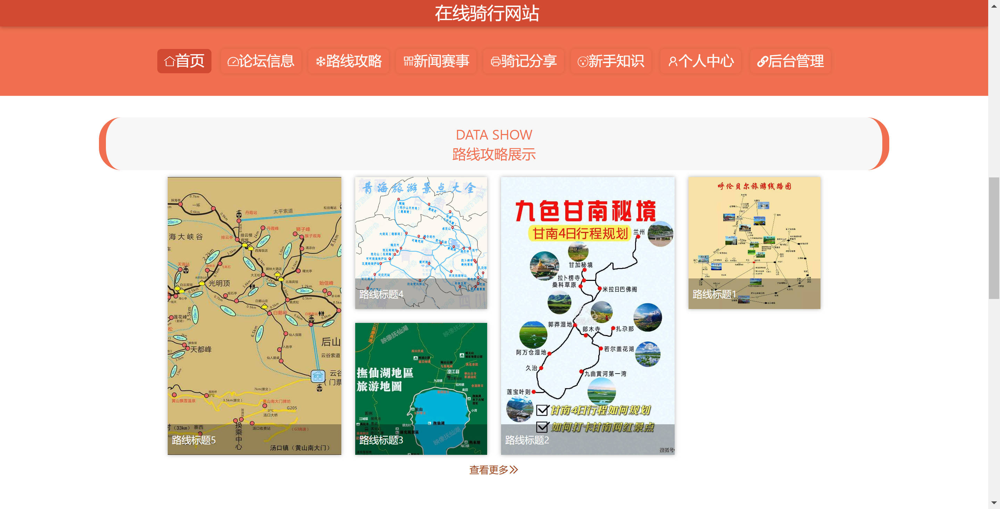
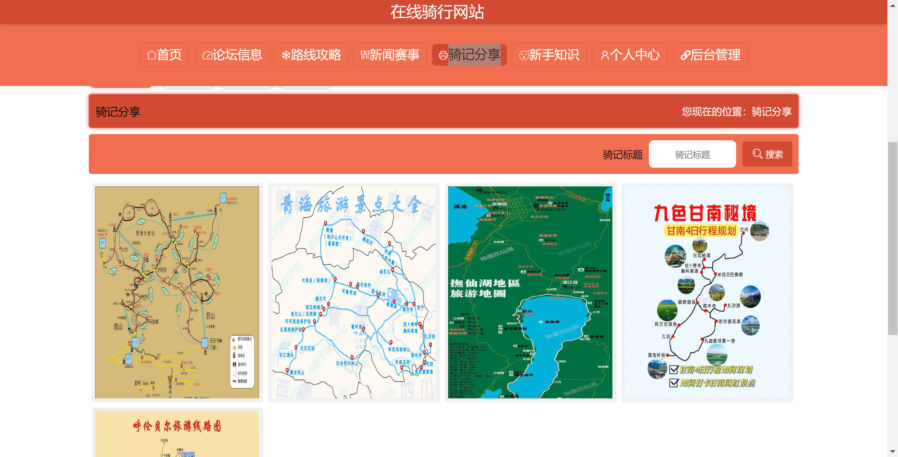
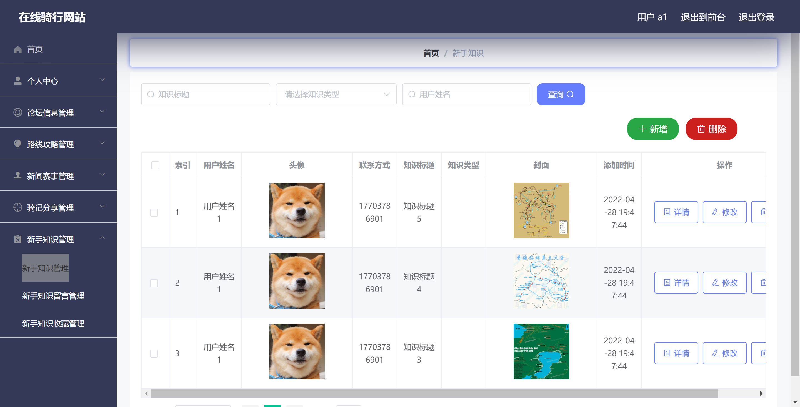
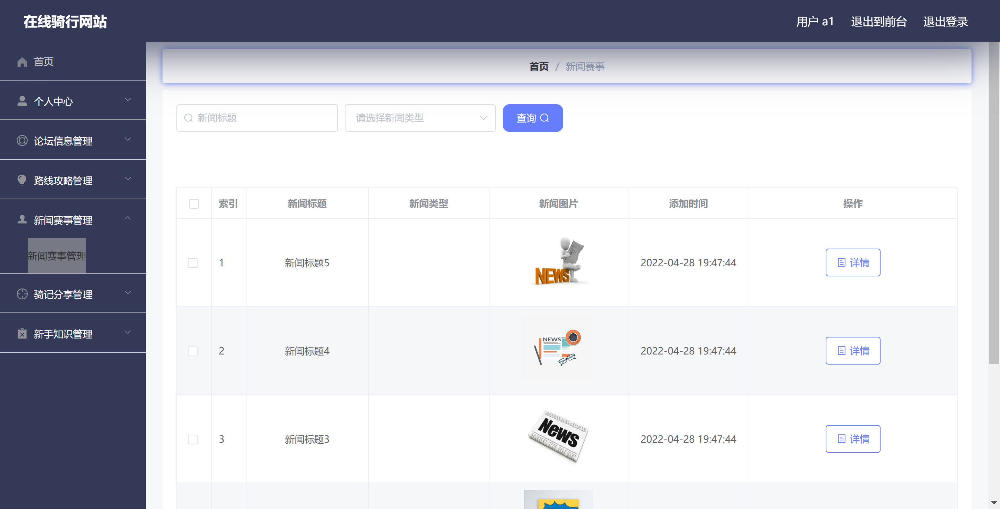
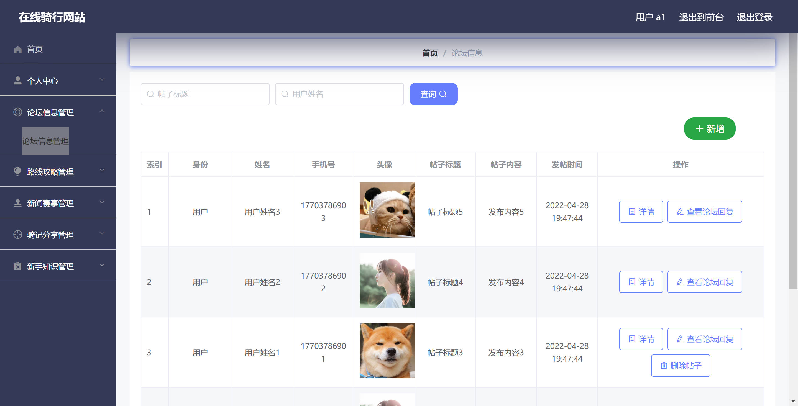
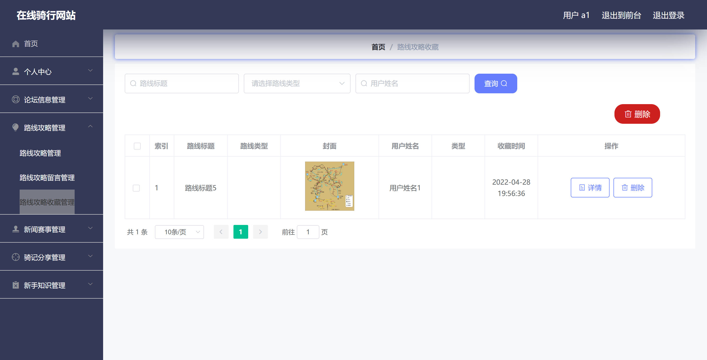

<h1 align="center">基于Spring Boot 的在线骑行网站【带论文】</h1>

- <b>完整代码获取地址：从戎源码网 ([https://armycodes.com/](https://armycodes.com/))</b>
- <b>技术探讨、资料分享，请加QQ群：692619798</b>
- <b>作者微信：19941326836  QQ：952045282</b>
- <b>承接计算机毕业设计、Java毕业设计、Python毕业设计、深度学习、机器学习</b>
- <b>选题+开题报告+任务书+程序定制+安装调试+论文+答辩ppt 一条龙服务</b>
- <b>所有选题地址 ([https://github.com/Descartes007/allProject](https://github.com/Descartes007/allProject)) </b>

## 一、项目介绍

基于SpringBoot的在线骑行网站，系统角色为 管理员 与 普通用户（用户/游客），主要功能如下
### 管理员：
- 基本操作：登录、修改密码、获取/修改个人信息
- 用户管理：筛选用户、查看用户详情、新增/修改/删除用户、获取在线状态
- 资讯管理（News）：后台列表、详情、新增、修改、删除、批量导入、前端列表/详情控制
- 路线攻略管理（Luxian）：后台列表、详情、新增、修改、删除、批量导入、前端列表/详情控制
- 骑记分享管理（Qijiriji）：后台 & 前端 CRUD、批量导入、收藏管理
- 新手知识管理（Xinshouzhishi）：后台 & 前端 CRUD、收藏管理
- 论坛管理（Forum）：帖子发布/管理、回复/父子帖子处理、状态审核
- 收藏/留言管理（Collection / Liuyan）：查看与管理用户收藏与留言
### 普通用户（用户/游客）：
- 基本操作：注册、登录、修改密码、获取/修改个人信息
- 内容浏览：查看新闻、路线、骑记、新手知识、论坛列表与详情（公开接口）
- 内容操作：发布骑记/路线/帖子（需登录）、编辑/删除自己的内容
- 互动功能：对文章/路线/骑记进行收藏，发布留言/回复

## 二、项目技术

- 编程语言：Java（后端）、JavaScript（前端）
- 项目架构：B/S（前后端分离）
- 前端技术：Vue 2、vue-router、Element UI、Axios（封装统一请求）、vue-quill-editor（富文本）
- 后端技术：Spring Boot、MyBatis-Plus（ORM/Wrapper/分页）、自定义 Token 认证（TokenService）、Fastjson（JSON 处理）、MySQL

## 三、运行环境

- JDK版本：1.8及以上都可以
- 操作系统：Windows7/10、MacOS
- 开发工具：IDEA、Ecplise、MyEclipse都可以

## 四、数据库配置文件

- npm版本：6.14.13及以上都可以
- Redis版本：3.2.100及以上都可以
- 文件名：application.yml
- 编码类型：utf8

## 论文截图

## 系统截图

